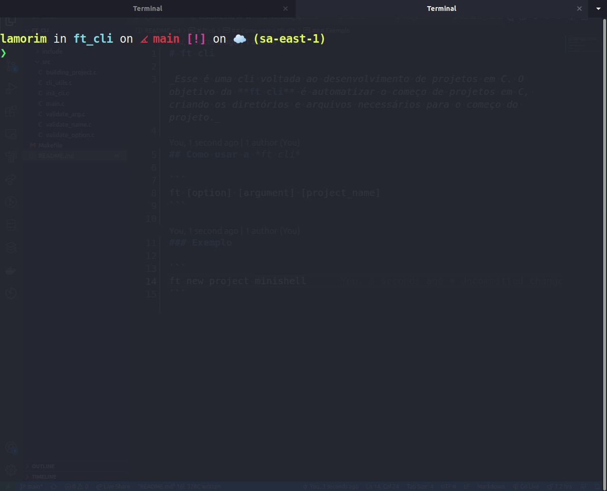

# ft_cli

_Essa é uma CLI voltada ao desenvolvimento de projetos em C. O objetivo da **ft_cli** é automatizar o começo de projetos em C, criando os diretórios e arquivos necessários para o começo do projeto._

## Como instalar

O comando a seguir instalará o projeto em sua máquina.

```sh
sudo make install
```

## Como usar a *ft_cli*

```
ft <nome-do-projeto> [--libft]
```

### Exemplo

```
ft minishell
```

A opção `--libft` habilita a clonagem do seu repositórido do libft para a pasta do projeto. Na primeira execução, você deverá indicar a URL do seu repositório da libft. Essa URL ficará salva no diretório `~/.config/ft`, e pode ser alterado a qualquer momento pelo usuário.

```
ft minishell --libft

A config file for your default libft repository wasn't found.
Enter a URL to set it as default:
<libft-url>
```


