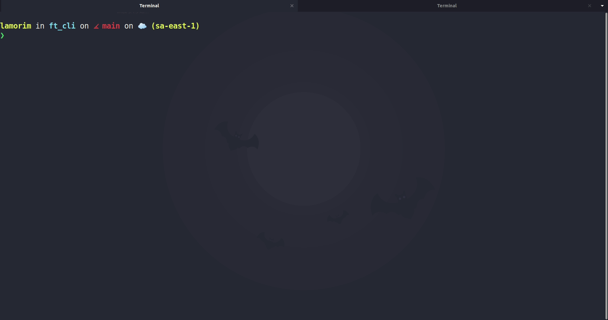

# ft_cli

The purpose of **ft_cli** is to automate the kickstart of C projects, creating the basic required directories and files for any project you start building.

## WARNING!

**ft_cli** aims to be a swift solution to the repetitive headache of creating the same file structure every time you start a new project. However, keep in mind that you should know how to start your own projects without needing it. It is a mere convenience for us cadets, but shouldn't be seen as a replacement to basic knowledge. Learning how to create a Makefile and a fluid workflow structure is very important, and you must not skip those steps. Also, using a convenience tool without understanding exactly what it does and without knowing how to replicate it's behavior manually WILL be considered CHEATING.

## Installation

The following `make` rule will compile and install **ft_cli** in your machine, as well as it's `man` page.

```sh
sudo make install
```

## Usage

```sh
ft [PROJECT-NAME] [OPTIONS]
```

### Examples

```sh
ft minishell
```
Will create a brand new directory called *minishell*, containing a perfectly working Makefile, a basic .gitignore for C programming, a README.md with your project's name, a header file and a C file with a main function.

Keep in mind that **ft_cli** cannot insert the 42 header in the files it creates, so you have to do it manually.

```sh
ft minishell --libft
```
Will do the same as the previous example, as well as clone your libft repository into the new project's directory. If it is your first time using **ft_cli**, a prompt will be displayed asking for your libft repository URL. Once you enter a valid URL, it will be stored at `~/.config/ft`, and can be altered whenever you want to. After that, any call to the `--libft` option will use the URL present in that file.

```sh
ft minishell --actions
```
Will do the same as the first example, as well as clone a GitHub Actions workflow into the new project's directory. The directory `.github` will be created, as well as a `workflows` subdirectory, with a `.yaml` file inside. This file is responsible for creating a workflow that will push your project to the Vogsphere remote repository whenever you push to your GitHub repository. Keep in mind that, in order for it to work, you have to set the required Secrets in your project's page. See [this page](https://github.com/araggohnxd/vogsphere-github-actions) for more info.

You can also mix options, like so:
```sh
ft minishell --libft --actions
ft minishell -la
ft -al minishell
```


